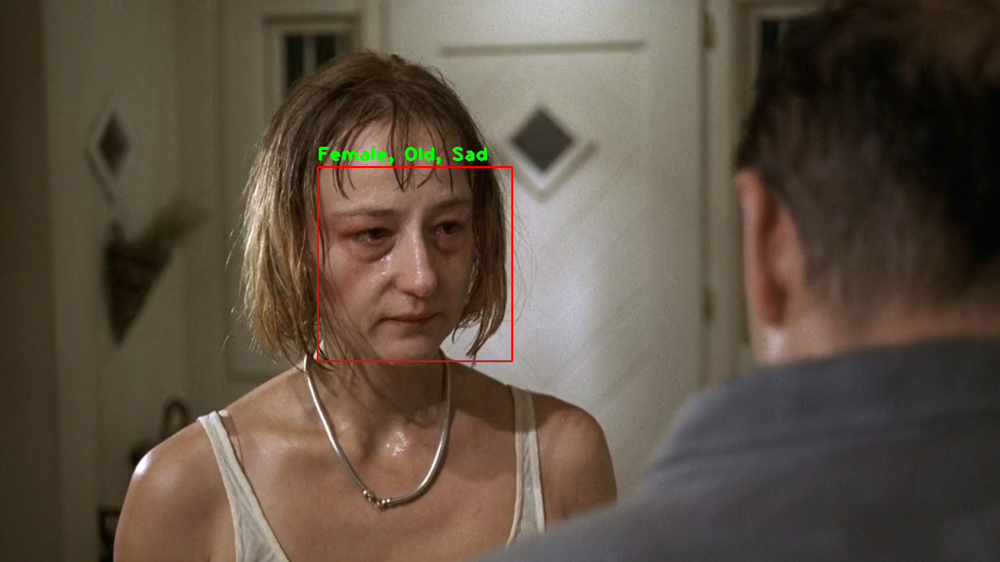

# MTL Age Gender Emotion Classification
Multi Task Learning example with Keras

*Funny Games (1997), Michael Haneke*

## What is Multi Task Learning
TODO

## Model Architecute
TODO

## Training Pipeline
TODO

## Inference
TODO