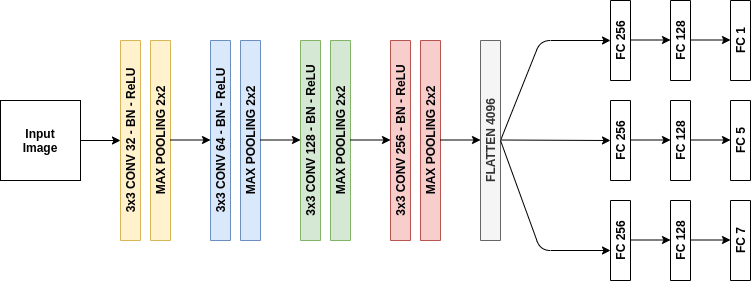

# MTL Age Gender Emotion Classification
Multi Task Learning example with Keras

*Funny Games (1997), Michael Haneke*

## Multi Task Learning
- MTL aims to leverage useful information contained in
multiple learning tasks to help learn a more accurate learner for each task. Based on an assumption that all the tasks, or at least a subset of them,
are related, jointly learning multiple tasks is empirically and theoretically found to lead to better performance than learning them independently [1]
- By using MTL, it might be possible to increase performance even further by forcing the model to learn a more generalized representation as it learns (updates its weights) not just for one specific task but a bunch of tasks. [2]

## Model Architecture

## Dependencies
- Python 3.6+
- `pip install -r requirements.txt`

## Datasets
- Age Gender Datasets
    - Three datasets were merged for age, gender classification.
        - The OUI-Adience Face Image Project [3]
        - The AginG Faces in the Wild (AGFW) [4]
        - UTKFace [5]
    - Faces were cropped with dlib[6] face detector.
    - Deepgaze[7] Head Pose Estimator was used for frontal faces control.
    - Age Labels were divided to 5 classes;
        - Child (0-18)
        - Young (18-30)
        - Middle Age (30-45)
        - Old (45-65)
        - Very Old (65+) 
        
- Emotion Datasets
    - Two datasets were merged for emotion classification.
        - FER 2013 [8]
        - Cohn-Kanade Dataset [9]
    - Age and gender classes were labeled with pretrained age, gender classification model.

- Dataset set sample can be found at `sample_dataset.csv`

## Training Pipeline
- After run the train scripts, `pretrained_models` and `graphs` folders will be created. Models and training graphs will be saved in that folders.
- Firstly age, gender classification model was trained because these datasets have more data. This makes model more trustworthy.
    - `python train.py --model_type age_gender --csv_path sample_dataset.csv`
- After age, gender classification model was trained, age and gender classifications of emotion datasets was made.
- Age, gender classification model was loaded with its weights and was added one more output for emotion classification. (Don't forget to update pretrained age, gender classification model path from `config.py`)
    - `python train.py --model_type age_gender_emotion --csv_path sample_dataset.csv`

## Pretrained Models
- You can download pretrained models of both type of classification [here](https://drive.google.com/drive/folders/18HNRw6W2CuyIOnypZXixCbBxnCDV09qD?usp=sharing)!
- Results of age, gender classification
    - | Branch  | Tranining Accuracy | Test Accuracy |
      |---------|--------------------|---------------|
      | Age     | 69%                | 67%           |
      | Gender  | 94%                | 92%           |
- Results of age, gender, emotion classification
    - | Branch  | Tranining Accuracy | Test Accuracy |
      |---------|--------------------|---------------|
      | Age     | 76%                | 69%           |
      | Gender  | 92%                | 86%           |
      | Emotion | 66%                | 61%           |

## Inference
- Run inference with image
    - `python inference.py --model_path ./path/to/model --source image --path /path/to/image`
- Run inference with video or webcam
    - `python inference.py --model_path ./path/to/model --source video --path /path/to/video`
    - `python inference.py --model_path ./path/to/model --source video --path 0`

## References
- [1] [An overview of multi-task learning, Yu Zhang and Qiang Yang](https://watermark.silverchair.com/nwx105.pdf?token=AQECAHi208BE49Ooan9kkhW_Ercy7Dm3ZL_9Cf3qfKAc485ysgAAApcwggKTBgkqhkiG9w0BBwagggKEMIICgAIBADCCAnkGCSqGSIb3DQEHATAeBglghkgBZQMEAS4wEQQMb8VtGhI5RiHT2H7xAgEQgIICSkZUc8gR5BPvDc2ZDMkkY_ogbyww2vLZiCXreTMw_SRWxS1TYCx0EMOxymgc9EgPZyJ8fepl-lizv6y00r5iEnB07kGjVemI57xXT9SG8ZYY9sJM5isXd3Vdj24qtdsN3JXhmyJvtdkw_qzrDu1KUoMKwEQAwp5aPMHsKo7DDAwmoc4usxVNShjWbXfKC-yrMTV9JPsG-g0wTA1TVHl--E0yDxy0Ubk-T-MCwMU1rKL83PoywffKhbwa4QYfP_S7_ABMgBhztbZ2_PM9Jxq1ZTvgngMvNBqcvszBqX0T_ZjABxBGCblrT7wAI97S_6g4iv6J0TmldkpfEkzcLQtlQ5LDzbOdhGkMlTVDJxLXoXg54MzlmywTp-pwGOQFUaYu7qSbZUVsvOirJ2oXgSR2yGzHNS-LSrguWt-SQdWKpT1zKcWjhVf-7XMXl7CClURoqra0-nHcrKqmQfHsJ32StmXQWL74I8ip-EjDhBpXmARutYoUuav4vK4-jZyP6COPNs2Ch_O8KbcHrCQm68YpXJDqiyBq7l8loZ48SIUoIMTrc547WNnwILGEEIOrApytdL_ta9fuqPo9jFSf26Zb4A41mlObnwaAY-Im2ByJW9KY_Rdo1sLXlJltnrVRouQfK-6QfSI5fHbRWopRehaDYrytRGOIqb43_bbAT4Y5iYZYC_-22z-UbpcYctNjZhWG1NFzT2YMDfBr1mO36JKm5MB3TeJttRC8XFyLwNby5QhqgFbbMstEQdYxyEyHbjVipy5uujIDwFD9JnI)
- [2] [Introduction to Multi-Task Learning(MTL) for Deep Learning / GeekforGeeks](https://www.geeksforgeeks.org/introduction-to-multi-task-learningmtl-for-deep-learning/)
- [3] [The OUI-Adience Face Image Project](https://talhassner.github.io/home/projects/Adience/Adience-data.html)
- [4] [The AginG Faces in the Wild (AGFW)](https://dcnhan.github.io/projects/aging_project/the-agfw-database.html)
- [5] [UTKFace](https://susanqq.github.io/UTKFace/)
- [6] [Dlib](https://github.com/davisking/dlib)
- [7] [Deepgaze](https://github.com/mpatacchiola/deepgaze)
- [8] [FER 2013](https://www.kaggle.com/deadskull7/fer2013)
- [9] [Cohn-Kanade Dataset](https://www.kaggle.com/c/visum-facial-expression-analysis)